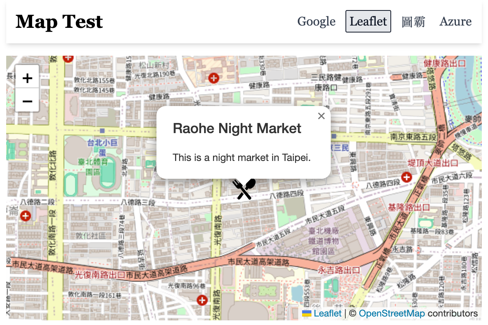
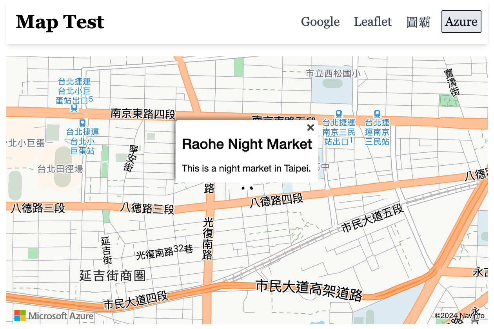

# Map Integration Project

This project demonstrates the implementation of four different map libraries: Google Maps, Azure Maps, Leaflet, and Map8 (Taiwan Map).

All maps implement custom markers and pop-up windows that appear upon clicking.

## Project Structure

The project uses React Router for navigation and includes the following main components and pages:

- **Google**: The page demonstrating Google Maps integration.
- **Leaflet**: The page demonstrating Leaflet integration.
- **Map8**: The page demonstrating Map8 (Taiwan Map) integration.
- **Azure**: The page demonstrating Azure Maps integration.

## Screenshots

### Google


### Leaflet



### Map8


### Azure



## Routes

The routes are defined in `appRouter.tsx` as follows:

- `/`: Home page
- `/google`: Google Maps page
- `/leaflet`: Leaflet page
- `/map8`: Map8 (Taiwan Map) page
- `/azure`: Azure Maps page

## Getting Started

To run this project locally, follow these steps:

1. Clone the repository:

```sh
git clone https://github.com/AilentDE/react-exercise-self.git
cd react-exercise-self/pratice-map-module
```

2. Install dependencies:

```sh
npm install
```

3. Create enviroment file `.env` with keys:

```
VITE_GOOGLE_MAP_KEY=
VITE_MAP8_KEY=
VITE_AZURE_MAP_KEY=
```

4. Start the development server:

```sh
npm run dev
```

5. Open your browser and navigate to `http://localhost:3000`.

## Library Documentation

| Library Name      | Documentation URL                                                                     | Version |
| ----------------- | ------------------------------------------------------------------------------------- | ------- |
| Google            | https://visgl.github.io/react-google-maps/                                            | 1.3.1   |
| Leaflet           | https://react-leaflet.js.org/                                                         | 2.9.4   |
| Map8              | https://www.map8.zone/vector/index                                                    | null    |
| Azure             | https://azure.github.io/react-azure-maps/index.html                                   | 1.0.0   |
| Azure(playground) | https://azure.github.io/react-azure-maps-playground/?path=/docs/getting-started--docs | null    |
