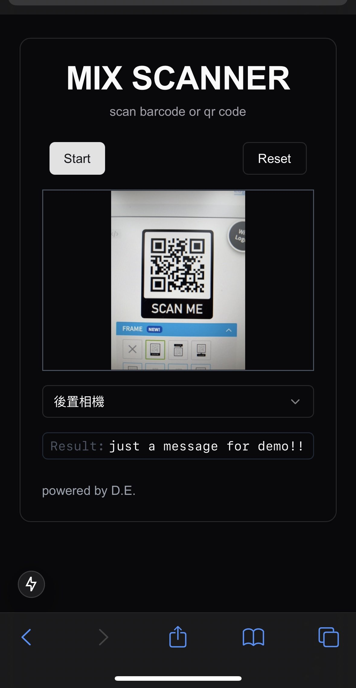

# Barcode Scanner Project

This project demonstrates the implementation of barcode scanner with [ZXing](https://github.com/zxing-js/library).

I initially planned to create separate scanners for barcodes and QR codes, but the package already supports recognizing both simultaneously.

## Screenshots

### barcode


### QR code



## Routes

- ~~`/barcode/1d`: 1D barcode scanning page~~
- ~~`/barcode/2d`: 2D barcode scanning page~~
- `/barcode/mix`: 1D/2D barcode mixed scanning page

## Getting Started

1. Clone the repository:

   ```sh
   git clone https://github.com/AilentDE/react-exercise-self.git
   cd react-exercise-self/pratice-barcode-scanner
   ```

2. Install dependencies:

   ```sh
   npm install
   ```

3. Run the development server:

   ```bash
   npm run dev

   # If you want use it with mobile device, run the server with https mode:
   npm run dev:https
   ```

4. Open [http://localhost:3000](http://localhost:3000) with your browser to see the [scanner page](http://localhost:3000/barcode/mix).

5. Select your camera device and click `Start` buttom then start scanning.

## Library Documentation

| Library Name   | Documentation URL                                      | Version |
| -------------- | ------------------------------------------------------ | ------- |
| @zxing/library | https://github.com/zxing-js/library?tab=readme-ov-file | 0.21.3  |
