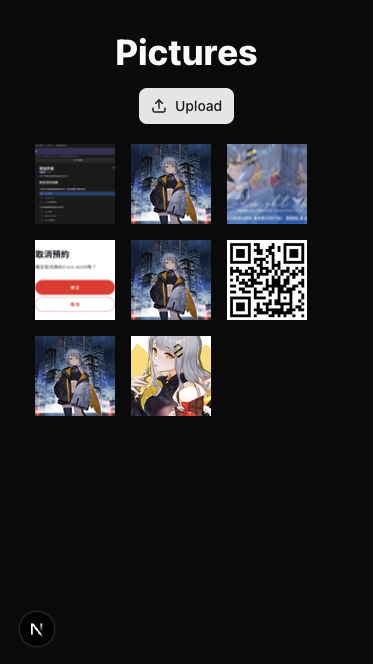
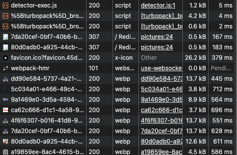
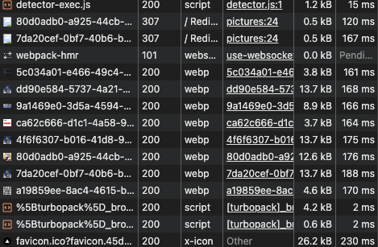

# Cloudflare R2 Image Upload Demo

A Next.js application that demonstrates image upload and management using Cloudflare R2 storage with a SQLite database for metadata storage.

## 🎯 Project Overview

This project serves as a frontend demonstration for image upload functionality that works in conjunction with a separate backend project called [**"practice-cloudflare-workers"**](https://github.com/AilentDE/node-exercise-self/tree/master/practice-cloudflare-workers). The backend utilizes Cloudflare Workers to handle third-party image uploads and retrieval.

### Key Features

- Image upload to Cloudflare R2 storage
- Image preview and management
- Responsive design with Tailwind CSS

## 📸 Screenshots & Performance Demo

### Frontend Interface



_Demonstrating the main interface of the application, including image upload functionality and image gallery display_

### Performance Comparison

#### Before Caching (webp)



_Image loading speed test results before caching_

#### After Caching (webp)



_Image loading speed test results after caching, showing significant performance improvement_

### Performance Benefits

Through Cloudflare Worker Cache API caching mechanism, image loading speed is significantly improved:

- **Before Caching**: Images need to be loaded directly from R2 storage, resulting in longer response times
- **After Caching**: Images are loaded through Cloudflare's CDN cache, greatly improving loading speed

## 🏗️ Architecture

### Frontend (This Project)

- **Framework**: Next.js 15 with App Router
- **Styling**: Tailwind CSS with shadcn/ui components
- **Database**: SQLite (better-sqlite3) for metadata storage
- **Storage**: Cloudflare R2 for image files

### Backend Integration

This frontend works with a separate backend project that implements:

- Cloudflare Workers for serverless image processing
- Third-party upload endpoints
- Image transformation and optimization

## ⚠️ Important Notes

### SQLite Usage Warning

This project uses SQLite for data storage, which is **NOT recommended for production environments**. In production deployments, the database may become read-only and unable to update data. Consider migrating to a proper database solution like:

- PostgreSQL
- MySQL
- Cloudflare D1
- Supabase
- PlanetScale

### Development vs Production

- **Development**: SQLite works fine for local development
- **Production**: Use a proper database service to avoid data update issues

## 🚀 Getting Started

### Prerequisites

- Node.js 18+
- Cloudflare R2 account and credentials
- Access to the backend "node-practice-self" project

### Environment Variables

Create a `.env.local` file with the following variables:

```env
R2_ACCOUNT_ID=your_cloudflare_account_id
R2_ACCESS_KEY=your_r2_access_key
R2_SECRET_KEY=your_r2_secret_key
R2_REGION=auto
R2_BUCKET_NAME=your_bucket_name
```

### Installation

1. Clone the repository:

```bash
git clone <repository-url>
cd test-cloudflare-r2
```

2. Install dependencies:

```bash
npm install
```

3. Set up your environment variables

4. Run the development server:

```bash
npm run dev
```

5. Open [https://localhost:3000](https://localhost:3000) in your browser

## 📁 Project Structure

```
src/
├── app/
│   ├── api/asset/          # R2 upload/download endpoints
│   ├── pictures/           # Image gallery page
│   └── page.tsx           # Home page
├── components/
│   ├── composite/         # Complex UI components
│   └── ui/               # Base UI components
├── config/
│   ├── db.ts             # SQLite database configuration
│   └── r2.ts             # Cloudflare R2 client setup
├── actions/
│   └── uploadImage.ts    # Image upload utilities
└── lib/
    ├── imageLoader.ts    # Custom image loader
    └── utils.ts         # Utility functions
```

## 🔧 Available Scripts

- `npm run dev` - Start development server with HTTPS support
- `npm run build` - Build for production
- `npm run start` - Start production server
- `npm run lint` - Run ESLint

## 🖼️ Features

### Image Upload

- Direct upload to Cloudflare R2
- Presigned URL generation
- Progress tracking
- File validation

### Image Gallery

- Display uploaded images
- Responsive grid layout
- Image optimization with Next.js Image component

### Theme Support

- Dark/Light mode toggle
- Persistent theme preference
- Smooth transitions

## 🔗 Backend Integration

This frontend requires the **"node-practice-self"** backend project to be running for full functionality. The backend provides:

- Cloudflare Workers endpoints
- Image processing and optimization
- Third-party upload handling

## 🛠️ Technologies Used

- **Frontend**: Next.js 15, React 19, TypeScript
- **Styling**: Tailwind CSS, shadcn/ui
- **Database**: SQLite (better-sqlite3)
- **Storage**: Cloudflare R2 (AWS S3 compatible)
- **Deployment**: Vercel-ready

## 📝 License

This project is for educational and demonstration purposes.

## 🤝 Contributing

Feel free to submit issues and enhancement requests!
