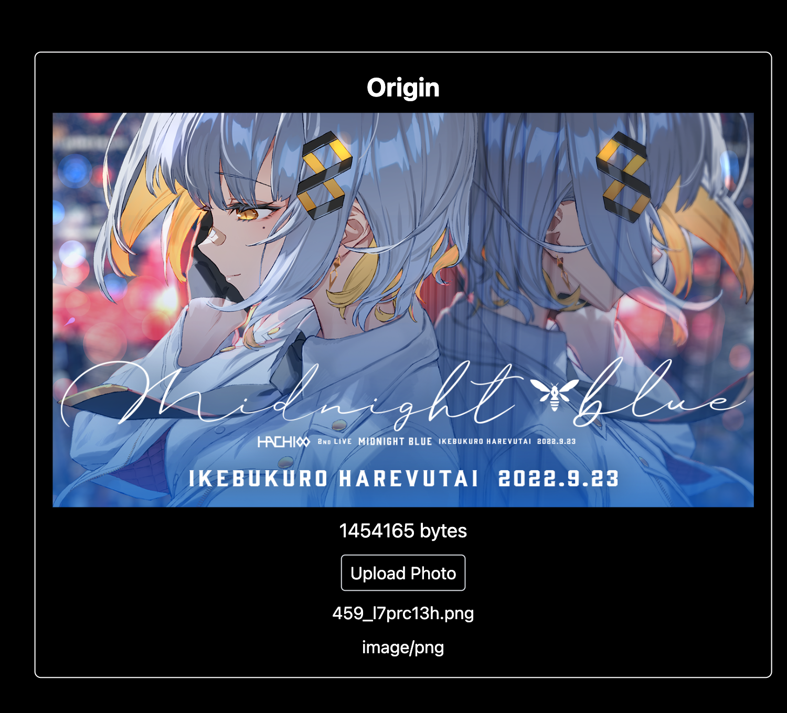
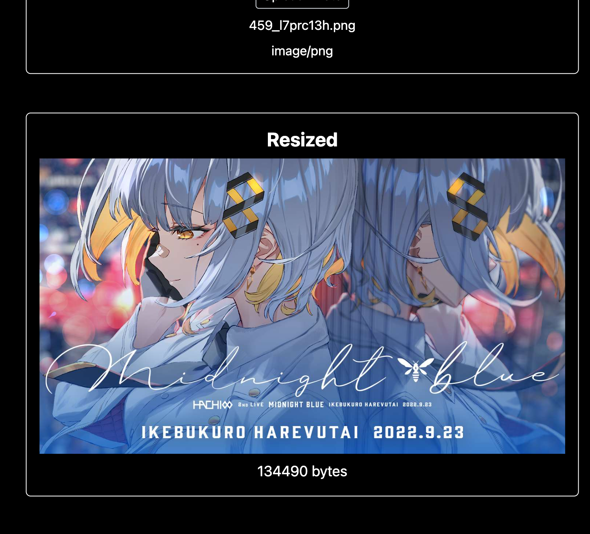

# Image Compression Project

This project demonstrates the implementation of image compression using the [compressorjs](https://github.com/fengyuanchen/compressorjs) library.

The main goal is to test the compression effects on various images and provide real-time previews of both the original and compressed images along with their actual sizes.

## Screenshots

### Original Image



### Compressed Image



## Getting Started

1. Clone the repository:

   ```bash
   git clone https://github.com/AilentDE/react-exercise-self.git
   cd react-exercise-self/test-compress-photo
   ```

2. Install dependencies:

   ```bash
   npm install
   ```

3. Run the development server:

   ```bash
   npm run dev
   ```

4. Open [http://localhost:3000](http://localhost:3000) with your browser to see the image compression page.

5. Click the `Upload Photo` button to select an image, and the application will display both the original and compressed images along with their sizes.

## Library Documentation

| Library Name | Documentation URL                            | Version |
| ------------ | -------------------------------------------- | ------- |
| compressorjs | https://github.com/fengyuanchen/compressorjs | 1.2.1   |
