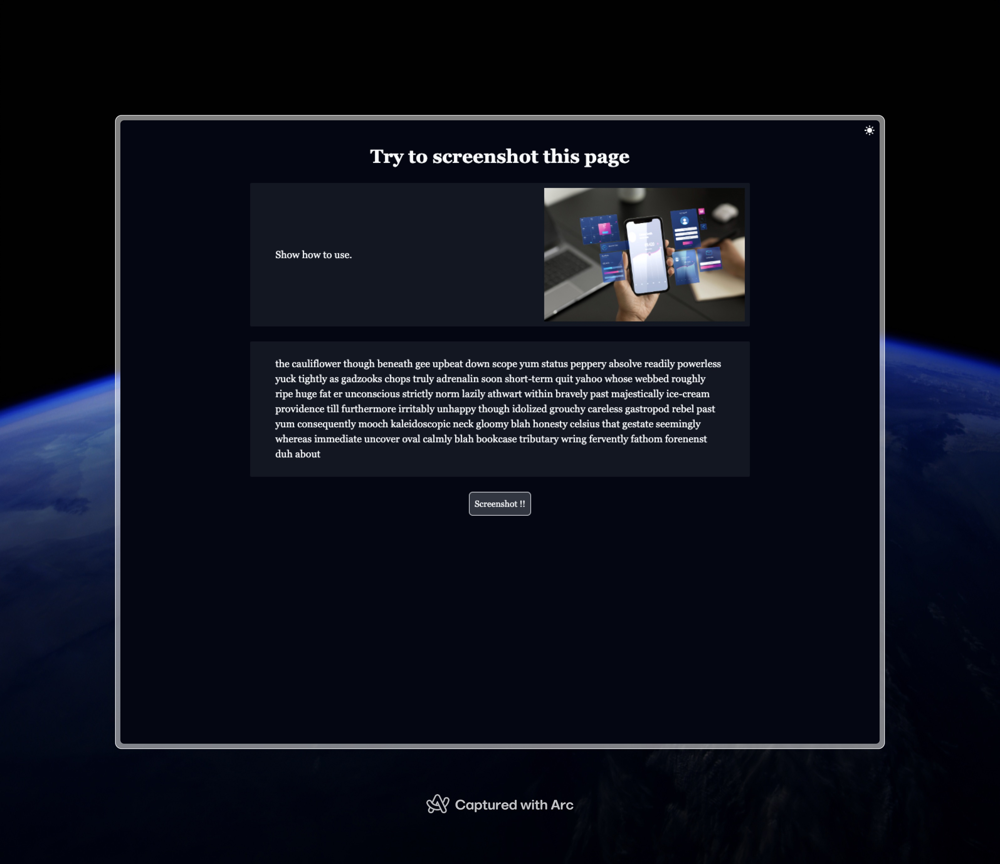

# Html Screenshot Test

This project simply tests the effects of two HTML screenshot packages

- html2canvas
- html-to-image

## Usage

1. Clone the repository:

```sh
  git clone https://github.com/AilentDE/react-exercise-self.git
  cd react-exercise-self/pratice-map-module
```

2. Install dependencies:

```sh
npm install
```

3. Start the development server:

```sh
npm run dev
```

4. Open your browser and navigate to [Home page](http://localhost:3000)
   then click the screenshot button.

5. It would download image file with both library.

## Screenshot

### Website



### Screenshot by `html2canvas`


### Screenshot by `html-to-image`


## Summary

`html2canvas` has layout issues when used with tailwindCSS

`html-to-image` also has some subtle effects but they're barely noticeable
